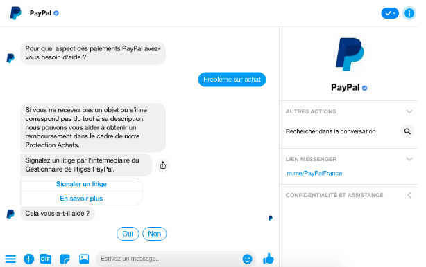

Quel est le prix de la livraison ? Comment retourner les articles d’une commande ? Sous quelles conditions ? Dans quel pays puis-je utiliser mon forfait téléphonique ?
Avez-vous perdu du temps sur un site web à chercher des réponses à ce type de question ?  

Si oui, vous avez surement dû faire face à des nombreuses pages de FAQ qui sont généralement très dense et où il est difficile de trouver des réponses...
Ces dernière année le web a subi de nombreuse mutation. Il y a une explosion des applications de messagerie tel que Messenger, WhatsApp et autres. 4/5 des applications les plus téléchargés en 2016 étaient des messageries instantanées. Enfin on peut compter 3 milliards d’utilisateurs actifs de messagerie instantanée par mois. Ces chiffres ont donner de nouvelles idées aux acteurs du web. Créer des Assistants virtuels capable d’interagir avec l’utilisateur pour répondre à ses besoins. On les appelle Chatbot. 

Un Chatbot c’est quoi ?   
---

Il existe plusieurs types de Chatbot. On peut généralement communiquer avec eux par la voix ou par l’écrit.   Dans les deux cas, il y a un dialogue entre le Chatbot et l’utilisateur.  Le Chatbot analyse les messages du client (la requête) et repérer les différents mots-clés puis essayer de répondre le plus pertinemment possible. 

Explosion du phénomène  
---
Initialement mettre en place un chatbot était pas chose aisé. Cela demandait d’avoir des connaissances en informatique et maitriser certain langage de programmation tel que Python ou en Php par exemple. Mais aujourd’hui, il existe des applications permettant de créer un Chatbot sans se soucier de la partie code. Et les associer avec un CMS (système de gestion de contenu) comme WordPress. Parmi eux on peut citer Collect.chat, Botify , Xo ou encore Sequel. 

Le cas Facebook  
---

Messenger de Facebook est l’un des applications qui aujourd’hui va le plus loin en termes de Chatbot. En effet, Facebook permet aux entreprises de mettre en place des chatbots dans la plateforme place au même rang que les messages envoient par vos proches. Depuis le lancement de la fonctionnalité. Plus de 100 000 Chatbot ont été créer. On peut prendre comme exemple Paypal. Qui vous envoie une notification pour vous informiez des prélèvements effectuer sur votre compte.

  

Conclusion  
---
Les chatbots sont arrivé pour permettre à l’utilisation de trouver les réponses à ses questions plus rapidement. La forte utilisation des applications de messagerie instantanée leurs a permis de s’imposer rapidement et durablement sur le marché des services webs.
